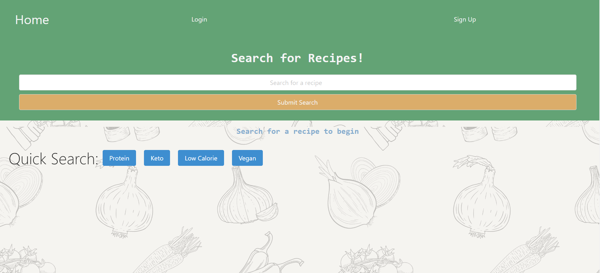
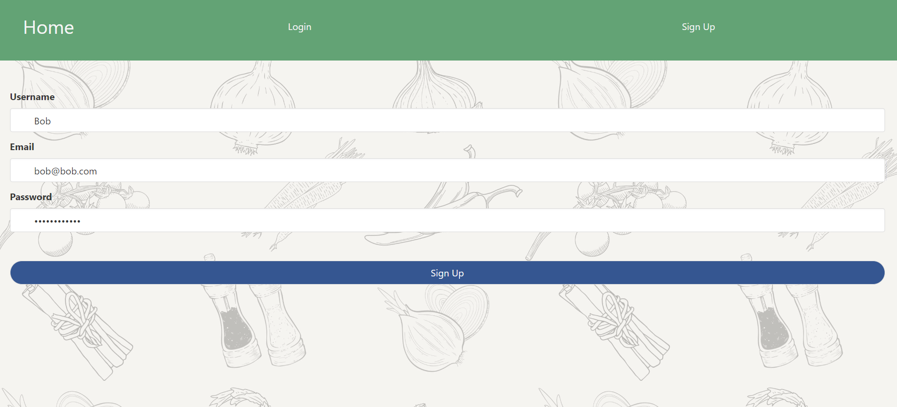
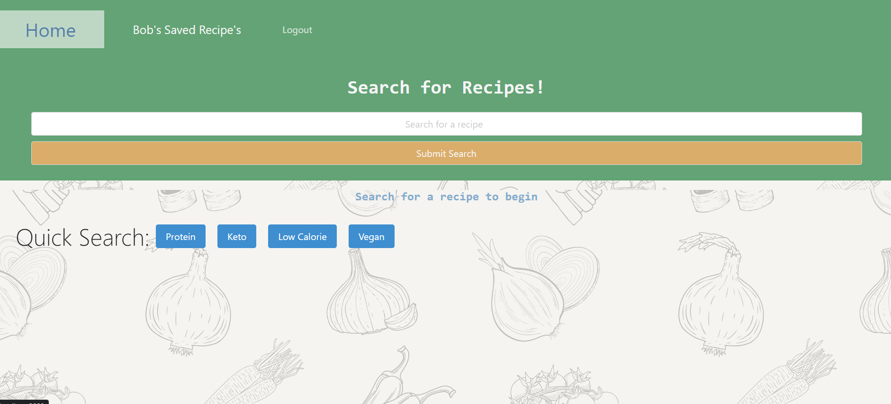
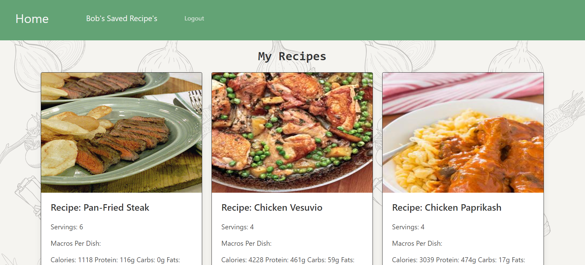

# searchNSaveRecipesWithMacros - An Interactive MERN Application

AS food enthusiasts we want to provide a interactive way to view and create a list of recipes and
with healthy eating in mind we want easy access to delicious meals that are also clear about their nutritional value
So THAT meal planning and enjoying our favorite dishes can be a quick and easy process that saves a great deal of time each week

## Review

This section is here to highlight the required elements needed for review:

* The following link will redirect you to our deployed link on Heroku:

Refer to this [Heroku Deployed URL](https://project-3-app-mck-b96b86dfcabe.herokuapp.com/) to view the functionality of this application
    

* The following link will redirect you to our GitHub repository, with a unique name and this README to describe the project:

Refer to this link [GitHub Repository](https://github.com/marinadelconte/Project-3) to view and explore the GitHub repo for this assignment

## Screenshots

The following images reflect the functionality and final results of development for this command-line application:

    

